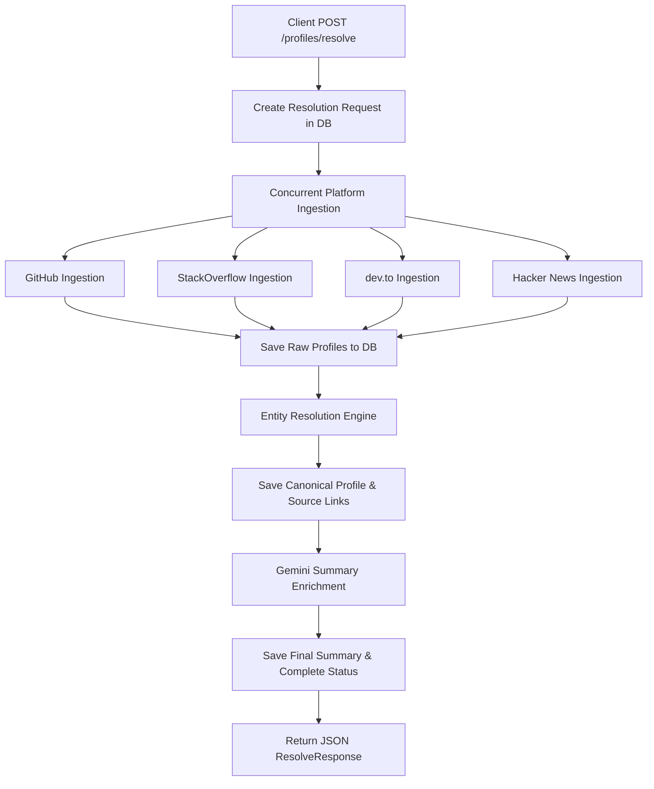

# Dev Profile Unifier (effiflo-dev-unifier)

A Python 3.11 FastAPI service to unify developer profiles across GitHub, StackOverflow, dev.to, and Hacker News using Gemini LLM enrichment and entity resolution.

---

## 1. Architecture Overview

The system processes developer queries through a structured pipeline:



### Data Flow
1. **API Call**: A request containing name, handles, and hints is sent to `POST /profiles/resolve`.
2. **Ingestion**: The system initiates concurrent API calls using `asyncio.gather` across GitHub, StackOverflow, dev.to, and Hacker News.
3. **Resolution**: The raw data is passed to the `EntityResolver` which evaluates identity match signals.
4. **Storage**: The matched profiles, source references, and original responses are persisted to Supabase database tables.
5. **Enrichment**: Gemini generative model (via `google-genai` SDK) generates a concise, 4-6 sentence summary of the resolved engineer.
6. **Response**: A resolution status (resolved, ambiguous, unresolved), confidence score, and profile ID are returned to the client.

---

## 2. Schema Design

Our database uses a robust **three-layer layout** within Supabase to preserve data history, enforce provenance, and support unified profiles:

- **Raw Data Layer (`raw_profile_data`)**: Stores unmodified JSON payloads from individual API client ingestion runs. This ensures we can re-run resolution strategies in the future without re-ingesting external data.
- **Canonical Layer (`canonical_profiles`)**: Represents a single resolved human developer entity containing unified details, merged languages, merged tags, and Gemini LLM summary text.
- **Linkage Layer (`profile_sources`)**: Connects raw data records to their respective canonical profile, storing the confidence score and signals that verified the connection.

---

## 3. Entity Resolution Strategy

The resolution engine evaluates identity mappings across platforms by running 5 signals sequentially:

| Signal | Maximum Weight | Logic |
| :--- | :--- | :--- |
| **SIGNAL 1**: `cross_platform_link` | **0.45** | Scans bio, blogs, and website URLs for direct hyperlinks pointing to the user's profiles on other developer platforms. |
| **SIGNAL 2**: `email_match` | **0.40** | Extracts emails from profiles, recent commits, or search hints. If an email overlaps in 2+ sources, it matches. The email is stored masked. |
| **SIGNAL 3**: `exact_handle_match` | **0.30** | Compares handle names across platforms (e.g. github, dev.to, HN) and queries after stripping formatting characters (`-`, `_`, `.`) and downcasing. Pairs match for 0.15 each up to 0.30 total. |
| **SIGNAL 4**: `name_location_match` | **0.25** | Normalizes full names and location strings. If name matches across 2+ sources and location matches, awards 0.25. If only name matches (no location), awards 0.10. |
| **SIGNAL 5**: `tag_overlap` | **0.10** | Collects programming languages and keyword tags. Computes the Jaccard similarity across active sets and multiplies the similarity coefficient by 0.10. |

### Confidence Thresholds
- **`resolved`** (Confidence $\ge$ 0.85): Accounts are verified to belong to the same person.
- **`ambiguous`** (0.50 $\le$ Confidence $<$ 0.85): High probability of matching, but requires manual audit or extra handles.
- **`unresolved`** (Confidence $<$ 0.50): Insufficient correlation to merge profiles.

---

## 4. Setup Instructions

### Local Development Setup

1. **Clone the repository:**
   ```bash
   git clone https://github.com/omshandilya/profile_unifier.git
   cd effiflo-dev-unifier
   ```
2. **Create and activate a virtual environment:**
   ```bash
   python -m venv venv
   .\venv\Scripts\activate  # Windows
   # or source venv/bin/activate on Unix
   ```
3. **Install dependencies:**
   ```bash
   pip install -r requirements.txt
   ```
4. **Environment Configuration:**
   Copy `.env.example` to `.env` and fill in your keys:
   ```bash
   copy .env.example .env
   ```
5. **Start the Development Server:**
   ```bash
   uvicorn app.main:app --reload
   ```
6. **Run Unit & Integration Tests:**
   ```bash
   pytest
   ```

### Render Deployment

The project includes a `render.yaml` blueprint:
1. Push your repository to GitHub.
2. Go to the Render Dashboard and choose **New > Blueprints**.
3. Link your repository. Render will automatically configure the Python web service using the parameters defined in `render.yaml`.
4. Fill in the environment variable secrets on the Render dashboard.

---

## 5. Environment Variables

| Variable | Description | Required / Optional |
| :--- | :--- | :--- |
| `GITHUB_TOKEN` | Personal Access Token to increase GitHub API rate limits. | Optional (highly recommended) |
| `STACKOVERFLOW_KEY` | StackExchange API key to increase quota. | Optional |
| `SUPABASE_URL` | The REST API endpoint of your Supabase project. | Optional (needed for storage layers) |
| `SUPABASE_SERVICE_KEY`| Supabase service role API key to bypass RLS. | Optional (needed for storage layers) |
| `GEMINI_API_KEY` | Google AI API key for Gemini 1.5/2.0 summary gen. | Optional (needed for LLM enrichment) |
| `ENVIRONMENT` | Defines app behavior. Typically `development` or `production`. | Optional (defaults to `development`) |

---

## 6. AI Tools Used

This project utilized **Claude** and **Gemini** agent models for code architecture implementation, API client design, database mapping, and test configurations.

---

## 7. Next Week (Development Plan Stub)

Our immediate roadmap focuses on:
- **Incremental Cache Layer**: Adding Redis caching for active profiles to avoid hitting downstream platform rate-limits on consecutive `/resolve` requests.
- **OAuth User Verification**: Exposing signup routes so developers can authenticate with GitHub, validating profiles with absolute 1.0 confidence.
- **Async Webhooks**: Redesigning the resolve loop to run asynchronously in a queue (e.g. Celery/SQS), notifying users via webhooks on slow query completion.
